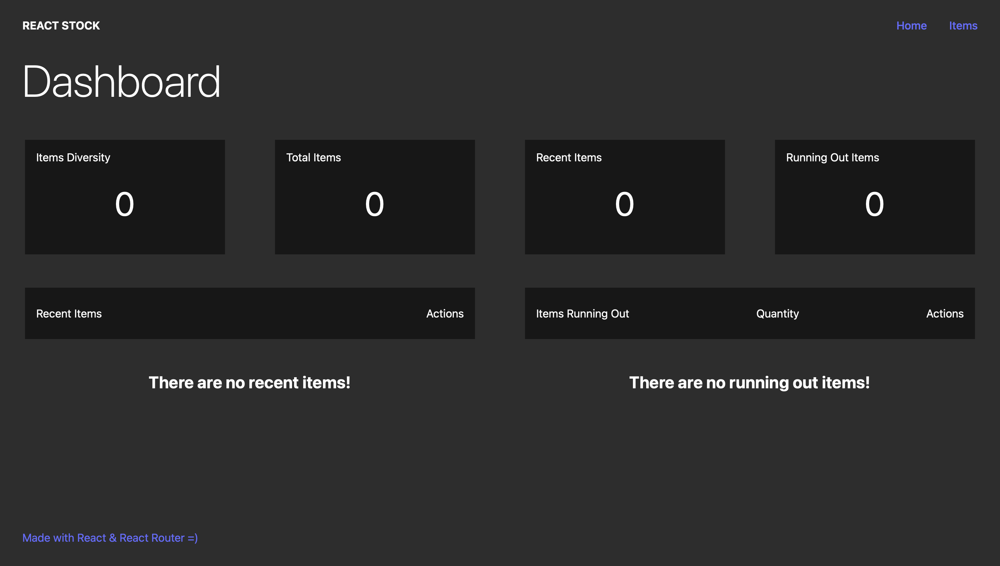
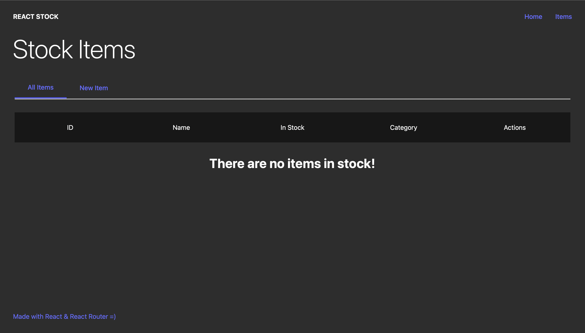

<h1>Stock Management</h1>

> Project Status: Finished (July 22, 2023)

### Topics

:small_blue_diamond: [Project Description](#project-description)

:small_blue_diamond: [Features](#features)

:small_blue_diamond: [Dependencies](#dependencies)

:small_blue_diamond: [Run App](#run-application)

## Project Description

<p align="justify">
  Stock Management application using React. The idea was to create a single page application using react-router.
</p>

## Features

:heavy_check_mark: Add, remove and view products.

## Dependencies

:warning: Node
<br>
:warning: TypeScript
<br>
:warning: BootStrap
<br>
:warning: SASS/SCSS





## Run application:

Clone project:

```
git clone https://github.com/EnzoBozzani/stock-management.git
```

Install dependencies:

```
npm install
```

Run project:

```
npm run dev
```
